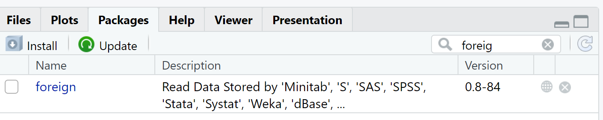

```{r setup, include=FALSE}
# In this chuck, all elements are loaded for the rest of the document!
library(learnr)
library(tidyverse)
library(nycflights13)
#library(stringer)

# Loading data
SouthAfrica <-read.csv2("https://www.unsiap.or.jp/on_line/ML/MLData/ML_SouthAfrica.csv")

SDG <- read.csv("./www/SDGperRegion.csv") %>%
  select(country, region_name,  population, gross_domestic_product, maternal_mortality_ratio, internet_use) 

mydata <- data.frame(name = c("John", "Sokol", "Chris"),
                     age = c(25, 30, 28),
                     student = c(TRUE, FALSE, FALSE))

```

## Welcome 

Welcome to the course. This is an interactive tutorial that should help you verify that you and your computer are ready to use the materials developed for this course using R and RStudio.^[This document uses materials developed by *Garrick Aden-Buie, Barret Schloerke, JJ Allaire & Alexander Rossell Hayes* , the creators of the [learner](https://rstudio.github.io/learnr/) package. *This version is 2.4 (October 2023)*.]  


### Learning Objectives
At the end of this tutorial you should be able to:   

* Install R on your computer
* Install the RStudio IDE (*Integrated Development Environment*) 
* Install the `tidyverse` R package
* Run a few lines of R code

You can skip this tutorial if you've already done these things and are familiar with R and RStudio environments, but it may be safer to check!

### Is this tutorial for you?

Do you need to work through the tutorial? Take the quiz below to find out.

```{r quiz1, echo = FALSE}
question("Check all that is TRUE:",
  answer("R is NOT installed on my computer", message = "* Install R"),
  answer("RStudio is NOT installed on my computer", message = "* Install RStudio IDE"),
  answer("The **tidyverse** package is NOT installed on my computer", message = "* Install Packages"),
  answer("I've done them all.", correct = TRUE, message = "You can skip the next steps and test your R skils directly"),
  type = "multiple",
  incorrect = "Don't worry, this tutorial is here to help!  To get set up follow the tutorial and follow (at least):"
)
```

>*We highly recommend that you follow the order of the items proposed in this tutorial*!

## Install R

### What is R? 
R is a statistical programming language and environment for statistical computing and graphics. It is an alternative to the traditional statistical packages such as SPSS, STATA and SAS. It has several benefits including: 

- it is open source – license free
- it can be used on 3 all operating systems: MacOS, Linux, UNIX and Windows; and 
- it is supported by an extensive community.

> If your computer was a plane, we may think of R as the engine and propeller

### How to install R
The best way is to follow the instructions in this video (*1 min 30s*)


Link to install R: [https://cran.r-project.org/](https://cran.r-project.org/)


### Test your knowledge

```{r quiz2, echo=FALSE}
quiz(caption = "Quiz - About R",
  question("Is R free to download and use?",
    answer("Yes!", correct = TRUE, message = "R is free _and_ open source, which means that anyone can read, use, and copy the source code of the R language."),
    answer("No.",  message = "R is indeed free _AND_ open source, which means that anyone can read, use, and copy the source code of the R language.")
  ),
  question("Where do you download R?",
    answer("www.rstudio.com/download"),
    answer("[cloud.r-project.org](http://cloud.r-project.org)", correct = TRUE, message = "You can also download R from [cran.r-project.org](http://cran.r-project.org)"),
    answer("www.r-project.org", message = "Good try, but not exactly. www.r-project.org doesn't provide a download link, but it does provide a link to one the websites above."),
    answer("www.r.com"),
    allow_retry = TRUE
  ),
  question("How often should you update R?",
    answer("Everytime you use it", message = "This will be too often unless you use R very rarely!"),
    answer("About once a year", correct = TRUE, "A new version of R is released about once a year. Update sooner if you encounter a bug that you cannot explain."),
    answer("Never", message = "A new version of R is released about once a year. I'll assume that you are using the newest version of R, which will be the fastest version with the fewest unexpected behaviors." ),
    random_answer_order = TRUE,
    allow_retry = TRUE
  )
)
```

## Install RStudio

### What is RStudio?
RStudio is an R-specific Integrated Development Environment (IDE). This means it is a piece of software that was built for R (even though it can support other programming languages software) that combines several tools in one environment to make working with R more productive. 

The RStudio IDE comprises several windows including a console, an editor for writing, editing and executing source code along with tools for plotting, viewing history, debugging and managing your workspace.

RStudio is the most common, beginner-friendly software for R users and the main tool that will be used for the practical exercises in this e-learning course.

> If your computer was a plane, we may think of RStudio as the cockpit  

### How to install RStudio

 RStudio makes editing, programming and visualizing in R much easier and we highly recommend that you install it and use it.  
 
 For that, follow the instructions in this video (*50 sec*)


Link to install RStudio: [https://www.rstudio.com/products/rstudio/download/ ](https://www.rstudio.com/products/rstudio/download/ )


### Test your knowledge

```{r quiz3, echo=FALSE}
quiz(caption = "Quiz - Install RStudio",
  question("What is the RStudio IDE?",
    answer("An application that makes it easier to use R.", correct = TRUE, message = "RStudio organizes your workspace and makes it easier to write, use, debug, and save R code. We highly recommend it and we will rely on the RStudio IDE in this course."),
    answer("An application that let's you use R without writing any code", message = "And thank goodness! Code provides a reproducible record of your work, which is essential for data science."),
    answer("A spreadsheet program like Microsoft Excel.", message = "No. Although we can visualise data in RStudio almost as in Microsoft Excel, RStudio is much more than that!"),
    answer("Another name for R", message = "No. R and RStudio are two separate things: R is the real data and code processing *engine* while RStudio is the environment that facilitate your life to provide instrcutions, like a *cokpit*. "),
    allow_retry = TRUE
  ),
  question("Is the RStudio IDE free to download and use?",
    answer("Yes!", correct = TRUE, message = "Like R, RStudio is free and open-source. There do exist professional versions of RStudio with enhanced features, but we will not rely on those features."),
    answer("No.", message = "Like R, RStudio is free and open-source. There do exist professional versions of RStudio with enhanced features, but we will not rely on those features.")
  ),
  question("Where do you download RStudio?",
    answer("www.rstudio.com/download", correct = TRUE, message = "For these tutorials, download and install the RStudio Desktop Open Source License."),
    answer("[cloud.r-project.org](http://cloud.r-project.org)", message = "This is where you download R, not RStudio."),
    answer("www.r-project.org"),
    answer("[cran.rstudio.org](http://cran.rstudio.org)"),
    allow_retry = TRUE
  ),
  question("Do you need to install R if you already have RStudio?",
    answer("Yes.", correct = TRUE, message = " Yes. RStudio needs the R *engine* to work"),
    answer("No.", message = "R does not come with RStudio; you need to install R separately. It is best to start by installing R and then RStudio.")
  )
)
```

## Install Packages
R has several functions that are loaded and available in the basic installation of the programme. However, there are a range of other convenient functions and codes written by R users that can be used freely during your R session. These functions are distributed as R packages, which are basically a collection of R code, data sets, documentation, and tests that can be easily shared with others.

> If your computer was a plane, we may think of the packages as all the components needed to fly (landing gear, gyroscope, lights, GPS, ... )   


### How to install R packages
The best way is to follow the instructions in this video (*1 min 32s*)


### The “tidyverse” package
To use an R package that did not come with the installation of RStudio, you must first install it, using the command `install.packages()`. 

For example, to install the package *tidyverse*, type and execute the following line of code in the script editor window. The argument for the R function is the name of the package, which must be enclosed by double quotation marks.  The tidyverse package is essential for data manipulation, exploration and visualization

```{r, eval= FALSE}
install.packages("tidyverse")
```


This command will install the package *tidyverse* and store it in a directory in the R environment referred to as the “library”. 
The *tidyverse* package contains 8 packages namely *ggplot2, dplyr, tidyr, readr, purrr, tibble, stringr, and forcats* that are loaded automatically once with the `install.packages(“tidyverse”)` command.

### The “foreign” and “haven” Packages 

One very commonly used R package is called “*foreign*”. This package is necessary to read and write data files from other statistical software such as SPSS, Stata, SAS and Minitab into R. It is also needed for reading and writing “dBase” files that carry the .dbf extension.

> To search for the “foreign” package, go to the “*Files/ Plots/ Packages and Help*” pane and select the tab Packages. Type “*foreign*” in the search bar. You should see a result like the image below.  The unchecked box means that the package is available in the library but has not been loaded for the library for use in the current R session.  {width=60%}


Similar to the “*foreign*” package, R includes a package called “*haven*” that also support the import and export of data sets in commercial statistical packages such as SPSS, Stata and SAS. 


### How to access packages after they have been installed

To use R packages during your R session, you must load it from the library using the `library()` function. For example, to load the foreign package, we do the following:

```{r, eval= FALSE}
library("foreign")
```

To access the manual for packages that have been loaded in the library, use the *help* argument with the function `library( )`


```{r, eval= FALSE}
library(help="foreign")
```


Alternatively, you can simply use `help( )` function and specify the name of the package:

```{r, eval= FALSE}
help("foreign")
```


> Note: You need to install R packages only once. However, you must load the relevant packages needed to perform the desired functions in R (using the `library( )` function), each time you start any R session.


### Test your knowledge

```{r names, echo = FALSE}
quiz(caption = "Quiz - Working with Packages",
  question("What command do you use to install packages?",
    answer("`library()`", message = "We will see what `library()` does later."),
    answer("`install.packages()`", correct = TRUE),
    answer("`install_packages()`"),
    answer("There is no command. You must visit [cran.r-project.org](http://cran.r-project.org) and download packages manually.", message = "R makes it easy to download packages. You connect to the internet and then run one of the commands above."),
    allow_retry = TRUE
  ),
  question("How often do you need to install a package on your computer?",
    answer("Every time you restart R"),
    answer("Every time you restart your computer"),
    answer("Only once. Afterwards, R can find it on your hard drive as needed.", correct = TRUE),
    answer("Never, as long as you are connected to the internet.", message = "This could be true if you are using R over a cloud service. However, if you are using R locally on your own computer, you will need to install each package that you use on your computer."),
    allow_retry = TRUE
  ),
  question("What is the tidyverse?",
    answer("A collection of packages that work well together and provide tools for common data science tasks.", correct = TRUE, message = 'You can install all of the tidyverse packages at once with `install.packages("tidyverse")`.'),
    answer("A word processing program for R"),
    answer("A code style that reads like poetry"),
    answer("An alternate universe where everyone is an R programmer."),
    allow_retry = TRUE
  )
)
```


## A short tutorial on R

### R Assignment Operator:
R uses ` <- ` as the assignment operator. This is a combination of the less than symbol (<) and hyphen (-). Essentially, the assignment operator tells R to assign values or data to a named object or variable.

```{r, eval =TRUE}
a <- 3 + 4
a
```

In the block of code above, we performed a simple mathematical operation **3 + 4** and stored the sum in **a** variable called a. Variables are used to store values for later use. The code above allows R to evaluate the expression 3 + 4 (on the right of the assignment operator) and then assign the sum 7, to the variable a (on the left of the assignment operator), for later use.

> Notice that the result is not immediately visible in the console. Instead, you can see the name of the variable in the R workspace, under the environment tab. To print out or view the content of the variable **a** in the console, simply type the name of the variable and run the command. You should now see the value (7) displayed in the console.

### Adding comments to your code:
It is a good practice to annotate your code in the R script editor. This includes adding short explanations on what the code or commands that you have written do as well as the meaning of variables or any objects that are created during an R Session. These explanations are written as comments.

In R, comments are preceded by the symbol `# ` (pound or hash). This helps R distinguish between comments and actual lines or blocks of code that the R programme must execute.


```{r, eval =TRUE}
# Create variable a that stores the sum of 3 and 4
a <- 3 + 4
a
```


###  Basic R syntax

Let us define some elements to play with: 

```{r}
# Here I define a numerical variable 
myage <- 25

# And I can show it
myage
```

Now if I want to make it pretty, I can use the `paste()` function.  This function is quite useful for presenting results, titles, etc; as it *paste* text ( within quotes "  ") and other R objects (here a number). 

```{r, prepâre}
paste("My age is", myage)

```


> R is **case sensitive**, which means that we have to be careful about how we name our objects and recall them 

***What will the following code return?** 
  
```{r, eval= FALSE}
MyAge <- 45
paste("My age is", myage)
```


```{r Case, echo = FALSE}
question("",
         answer("My age is 45",
                message = "Well, that would true be if ***MyAge*** and ***myage***  are similar. But since R is case sensitive, these two objects are different"),
         answer("My age is 25", message = "Well-done! \"My age is 25\" because R is case-sensitive", correct = TRUE),
         answer("25",
                message = "No, We used `paste()` to heave a sentence that assemble the text \"My age is\" and the value"),
         allow_retry = TRUE
)
```

Try it by yourself and click on the `Run Code`  blue button. You can modify the code to change value, rename the objects *myage*, *MyAge etc.  

```{r tryit, exercise = TRUE, exercise.eval = FALSE }
myage <- 25
MyAge <- 45

paste("My age is", myage)
```


### Objects

In R everything is an **object**. This means that an element may embed some other *"things"*

> Let's create objects!

#### Vectors

Vectors can be create (and conceived) as a concatenation of numbers. We use The c()`  function to concatenate objects.

```{r}
# Let's create a vector
a <- c(1, 2, 3)
# And another one 
b <- c(4, 5, 6)

# Assign values to "mystring"
mystring <- c(a, b)

mystring
```

We have a double concatenation here since `c(1,2,3)`is already a concatenate object (a vector here)

> But we can also concatenate things that are of **different nature**! 

***What will the following code return?** 
```{r , eval= FALSE}
myobject <- c("A" , 1 )
myobject

```


```{r Concat, echo = FALSE}
question("",
         answer("A1",
                message = "Well, not quite"),
         answer(" \"A \" \"1\" ", message = " Well-done", correct = TRUE),
         answer("An error",
                message = "No, We can really concatenate different things "),
         random_answer_order = TRUE,
         allow_retry = TRUE
)
```


### Data Frames

A data frame is the equivalent of a tabular, *i.e.* a 2-dimensional, rectangular, data structure, which stores data in rows and columns. We will use these structures a lot, and as any object in R, we can access to its different component with different methods

> Let's create data frames and play with them!

```{r}
# Creating a data frame
mydata <- data.frame(name = c("John", "Sokol", "Chris"),
                     age = c(25, 30, 28),
                     student = c(TRUE, FALSE, FALSE))
```

We have lots of tools to play with data frames


```{r, eval=TRUE}
# Here we have the first lines of this very small data frame
head(mydata)
```


The **structure** of the data frame is given by `str()` function. It is very important to identify which variable is numerical or  integer, or a character (string) or a Boolean (TRUE/FALSE) as some operations will only apply for some *type* of variables.

```{r}
str(mydata)
```

In this example,  we have 3 objects embedded in the data frame `mydata` which are: `name` (character), `age` (numeric) and  `student` (logical). Each element can be accessed directly by adding the  \$ sign to the data frame. For example, the full list of names can be accessed using:   

```{r}
mydata$name
```


But, we can also extract information directly from the data frame using its rows and columns.  

***What will the following code return?** 
  
```{r, eval= FALSE}
mydata[1,]
```


```{r extract, echo = FALSE}
question("",
         answer("The first row of mydata (John 25 TRUE) ", message = " Well-done", correct = TRUE),
         answer("The first column of mydata with all names (John Sokol Chris) ",
                message = "No, but that was close"),
          answer("The first element of mydata (John)",
                message = "No, try again"),
         random_answer_order = TRUE,
         allow_retry = TRUE
)
```

Check it out by yourself

```{r mydata, exercise = TRUE}
# run this code to find out! 
mydata[1,]

```

We can also have quick statistics using the  `summary()` function. As you see in the output, the `summary()`  function adapts the result to the **type** of variable, whether it is a character (no summary for  *name*), a numeric variable (*age*), or a Boolean or logical variable (*student* takes TRUE or FALSE values).  

> This is an important feature of R functions and highlights the importance having the right *type* for the variables used in our analysis.  


```{r, eval=TRUE}
# A summary
summary(mydata)
```

#### A new data.frame 

Consider the  `data.frame`  ***mynewdata*** 

```{r}
mynewdata <-  data.frame(
  name = c("Aldovia", "Borovia", "Corundia", "Dagbon", "Elbonia"),
  area = c(10000, 20000, 15000, 18000, 22000),
  flag_color = c("Red", "Blue", "Green", "Yellow", "Purple"),
  english = c(TRUE, FALSE, FALSE, FALSE, TRUE)
)
```


Play with `mynewdata` (recommended)  and **then** extract the **third** element of the **first** row

```{r prepare-a, exercise.eval = TRUE}
mynewdata <-  data.frame(
  name = c("Aldovia", "Borovia", "Corundia", "Dagbon", "Elbonia"),
  area = c(10000, 20000, 15000, 18000, 22000),
  flag_color = c("Red", "Blue", "Green", "Yellow", "Purple"),
  english = c(TRUE, FALSE, FALSE, FALSE, TRUE)
)
```


```{r extract2,  exercise = TRUE, exercise.eval = FALSE, exercise.setup = "prepare-a"}
# Enter your solution below


```

```{r extract2-hint-1}
# maybe you could use the head function first
head(mynewdata)

```


```{r extract2-hint-2}
# Now that you have seen the data, you have to extract elements and fill the blanks here:
mynewdata[ , ]

```


```{r extract2-solution}
# Solution : 1 for the row and 3 for column in that order
mynewdata[1,3]
```


> We'll see later on that there are many other ways to play with `data.frames`

##  Importing data into R

Before we can begin any analysis, we need to first read or import that data set into R.  
R allows the import of data of various types, from data stored in commonly used formats such as comma-separated values (CSV) or MS Excel (xls/xlsx) to those stored in commercial statistical packages such as SPSS, STATA or SAS. 

### Importing MS Excel files 

It is really easy to import files in R. As usual, we will just need to use the right package for that. We use here the package "**readxl**", even if some other exists.  As any package, you'll need to install it before loading using the `install.packages()` function.

The function `read_excel( )` accepts several arguments, such as the sheet to read in the excel file, or whether or not to use the column names, but the most important argument is the **path** to the xls/xlsx file, as below:  

```{r eval=FALSE}
# loading the readxl package
library(readxl)
# loading the data
Mydataset <- read_excel(path ="Myexcel.xls")

```

The lines of code above first load the package *readxl* using the `library()` function.  The second line, creates a data frame called *Mydataset* that stores the data from the excel data file called “*Myexcel.xls*”.  Remember that a data frame is a data structure in R that stores spread-sheet like data, as rows (observations or cases) and columns (variables). 


### Importing Stata files 

We will explore now how to import a data set in STATA file format, which carries the file extension *.dta*. 

To read a STATA data file into R, we use the command `read.dta( )` function.  To use this function, we need to load the “**haven**” package presented earlier.  This package has the relevant tools and functions to import data from commercial software.  

The function `read.dta( )` accepts only one argument, which is the full name or file path, including the file extension as shown below. 

```{r eval=FALSE}
# loading the  haven package
library(haven)
# loading the data from STATA file format
Mytest <- read.dta("testdata.dta")

```

The lines of code above first load the package *haven* using the `library()` function.  The second line, creates a data frame called *Mytest* that stores the data from the data file called “*testdata.dta*”. 


### Importing SPSS data into R

We will now see how to import a data set in SPSS file format that carries the file extension *.sav*.  To import or read files of that format into R, we need the R package called **foreign**. Like the **haven** package, the **foreign** package contains a range of functions that will allow you to import data files from some of the other statistical software packages aside from SPSS such as Stata and SAS into R. If you have not yet installed the foreign package, use the command `install.packages(“foreign” )`.  

We are now ready to read SPSS data into R.  To do this, we use the `read.spss( )` function. This function accepts several arguments. The first argument, *file is the name of the data file. The second argument  *to.data.frame* tells R to convert the data set into a data frame. We should assign a name to the data frame that will be created when the data set has been imported into R. 

```{r eval=FALSE}
# loading the foreign package
library(foreign)
# loading the data drom SPSS file
MyTest2 <- read.spss(file ="testdata.sav", to.data.frame=TRUE) 

```

The lines of code above first load the package *foreign* using the `library()` function. 
The second line creates a new data frame called *MyTest2* that stores the data from the SPSS data file called "*testdata.sav*".  


### Importing any file with RStudio

It is also possible to use the RStudio *environment* interface to load any data set. 


Then select the format of your file using the drop down menu. 


You can also configure options such as the sheet to open in excel, as shown [in this tutorial](https://uedufy.com/how-to-import-an-excel-file-into-r-6-easy-steps/) (from Leonard at Uedufy.com). 
 
 > **NB**: The code resulting form this operation will be copied in your document after the importation for reproducibility. 
 

## Data exploration

### Data sets operations 
We will use a pre-loaded data set with some SDGs. The name of the data frame is simply `SDG` 

####  The dataset
Before playing with some functions, let's have a look at the variables available in the `SDG` data set using some base R commands. 

First, let us see what are the variables using the `names()` function. 

```{r data, exercise = TRUE, exercise.eval = FALSE}
names(SDG)
```

Now, can you display the first 5 lines of the data set (maybe using using the `head()` function) ?


```{r filter2, exercise = TRUE, exercise.eval = FALSE}

```

**Note:** by default, `head()` shows the **6** first rows! 
*Try maybe with an option (type a comma, inside the function, after the name of the data frame to see some options)*


```{r filter2-solution}
head(SDG, n=5)
```

> That was easy, right? 


### Playing with `tidyverse` 
There are many functions available in this package `tidyverse`, in particular, one has many tools for filtering and visualizing the data. 
 
 First, let's examine the `pipe` operator that links operations:  `%>% `. 
 
Imagine we are only interested in the first 3 variables and want to count the number of countries that are in the "Asia" region.

```{r}
# I create a new data frame with only the first 3 variables (note the use of " : " )
df <- SDG[, 1:3]

#Now I want to subset that data to keep only the "Asia" region (note the use of " subset() " )
df <- subset(df, region_name == "Asia" & population >= 50) 

# Counting the number of rows (note the use of " nrow()" )
nrow(df)
```

This requires quite a few lines of code...

>  But there is a quicker and more readable solution


Then `%>% ` links operations in a very easy-to-read sequence. The code below does exactly the same operation as before, but using operation linking using  `%>% `

```{r filter1, exercise = TRUE, exercise.eval = FALSE}
SDG %>%  
  subset(region_name == "Asia" &  population >= 50) %>%
  nrow()
```


This operator `%>% ` (or *pipe*) will forward a value, or the result of an expression, into the next function call/expression.

> One may read  `%>% ` as *next do this (please)* !

An alternative to `subset()` is the function `filter()` that lets you use a logical test to extract specific rows from a data frame. `filter()` will return every row that passes **each** logical test.


### Test Your Knowledge
We can use many different operations to filter data, such as:

- ==  (identical),  > (strictly greater), >= (greater or equal)   
-  & (and) , | (or) , ! (not) 


***What will the following code return?** 
  
```{r, eval= FALSE}
SDG %>%  
  filter(region_name == 'Asia' | region_name == "Africa",
         internet_use > 60 ) 
  
```


```{r logicals, echo = FALSE}
question("",
         answer("Every country in either Asia or Africa with internet use greater than 60% ",
                message = " Yes, the filter applies to region_name with  \" | \"  wich means  \" or \" , Excellent!",
                correct = TRUE),
         answer("Every country with a name starting with \"A\" with internet use greater than 50% ",
                message = " No, the filter  applies to region_name  not to country. Try again!  "),
          answer("Every country in either Asia or Africa",
                message = " No, the filter also conditions on internet_use, try again!  "),
         answer("Every country  with internet use greater than 60%  ",
                message = " No, the filter applies also to region_name try again!  "),
         answer("An error. This is an incorrect way to combine tests.",
                message = "No, this code is perfectly fine and use two conditions"),
         random_answer_order = TRUE,
         allow_retry = TRUE
)
```


### Common mistakes

In R, the order of operations doesn't work like English. You **can't** write `filter(SDG, region_name == "Asia" | "Africa" )`, even though you want all countries that are either in Asia or Africa. 

Here are four more tips to help you use logical tests and Boolean operators in R:

###

1. A useful short-hand for this problem is `x %in% y`. This will select every row where `x` is one of the values in `y`. We could use it to rewrite the code in the question above:

```{r, eval = FALSE}
SDG %>%  
 filter(region_name %in% c("Asia", "Africa") , internet_use > 60 ) 
    
```

One may also use some advanced functions such as `str_starts` (*string starts with*), but in our case, the output will include "Americas"

```{r}
SDG %>%  
  filter(str_starts(region_name, 'A') , internet_use > 50 ) 
```

### Exercise 

Use the code chunks below to count the number of countries that:

#### Have a *maternal mortality rate* lower than 12%

```{r filterex1, exercise = TRUE}

```
    
```{r filterex1-solution}
SDG %>% 
  filter(maternal_mortality_ratio <= 12)
```


> Is there a problem in the result ? 

#### Find out wich are the countries with a negative values for *maternal mortality rate* 

```{r filterex2, exercise = TRUE}

```
    

    
```{r filterex2-solution}
# To ease the reading, we use select() to restrict to variables of interest 
SDG %>% 
filter(maternal_mortality_ratio < 0 ) %>%
  select(country, maternal_mortality_ratio)
```

#### Find the number of countries in Asia with a  *maternal mortality rate* lower than 30%? 

```{r filterex3, exercise = TRUE}

```

```{r filterex3-hint}
# Here there is a problem since we  have duplicates. One may use  distinct() 

SDG %>% 
filter(maternal_mortality_ratio <30 , region_name =="Asia" ) %>%
  select(country, population, maternal_mortality_ratio) 


```

```{r filterex3-solution}
# Solution: We use distinct() in the end to remove duplicates

SDG %>% 
filter(maternal_mortality_ratio <30 , region_name =="Asia" ) %>%
  select(country, population, maternal_mortality_ratio)  %>% 
  distinct() 


```

**Yes**,  there is a  duplicate problem! Can you solve it? (*see the `hints` to find out*).


> There are a lot of other things to learn, please read the [Tidyverse reference manual](https://dplyr.tidyverse.org/reference/index.html) and  enjoy other tutorials like [this one](https://www.r-bloggers.com/2021/04/tidyverse-in-r-complete-tutorial/)  or [that one](https://www.pkimes.com/PR2019replicathon/tutorials/0b_R_tidyverse.html) and search on the web by yourself, there are hundreds of examples. Enjoy!

---

### References:
Richard, Cotton (2013). Learning R. Sebastopol, California: O’Reilly Media.

RStudio IDE. (2021). RStudio. Retrieved October 4, 2021, from [https://www.rstudio.com/products/rstudio/download/](https://www.rstudio.com/products/rstudio/download/)

*Posit Primers* developed by RStudio (now *Posit*) are also useful references [https://posit.cloud/learn/primers](https://posit.cloud/learn/primers)

---
<p xmlns:cc="http://creativecommons.org/ns#" xmlns:dct="http://purl.org/dc/terms/"><span property="dct:title">This tutorial, created</span> by <span property="cc:attributionName">Christophe Bontemps (SIAP) </span>, is licensed under <a href="http://creativecommons.org/licenses/by-nc-sa/4.0/?ref=chooser-v1" target="_blank" rel="license noopener noreferrer" style="display:inline-block;">CC BY-NC-SA 4.0</a></p>

