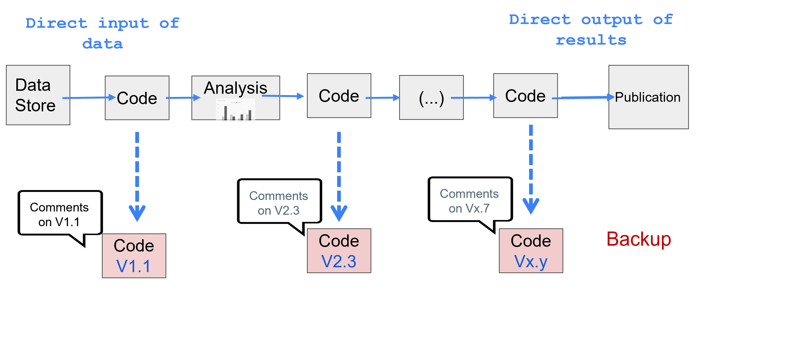

```{r setup, include=FALSE}
knitr::opts_chunk$set(echo = FALSE)
```

<!-- Extra custom code for footnotes - taken from https://stackoverflow.com/questions/42690955/how-to-insert-footnotes-in-ioslides-presentations-using-rmarkdown -->

```{=html}
<!-- PRESENTER NOTES
To view notes press "p" during the presentation on each slides with notes and an element with notes inside will appear. 

Note that you can use presenter mode by adding "presentme=true" to presentation url ("my-presentation.html?presentme=true"). Turn off presenter mode by adding "?presentme=false" to the url.

More information on "ioslides" available here: https://bookdown.org/yihui/rmarkdown/ioslides-presentation.html.
-->
```
## Fundamental Principles of Official Statistics {.columns-2 .build}

<p class="alignright">


</p>

<p class="forceBreak">

</p>

> -   Clear mention of the **process** used to produce statistics

> -   *To retain trust in official statistics, the statistical agencies need to decide according to strictly professional considerations, including scientific principles and professional ethics, on the* ***methods and procedures*** *for the collection*, ***processing***, *storage and presentation of statistical data*.

## Usual practice: Theory *vs* reality

<br><br>

<p class="aligncenter">


</p>

::: notes
Our ideal analytical pipeline has a clear set of steps that we do once in succession to create a final report.

Here, we:

1.  Download some data and store it in an excel file, which we create a formatted table within
2.  We load the excel data into R to generate a chart
3.  We then copy and paste the formatted table and chart into a word document and add some text and formatting to create the final report
:::

## Usual practice: In the end

<p class="aligncenter">


</p>

::: notes
In reality though, our ideal analytical pipeline can quickly become a complicated tangle of multiple file and data versions, programs, emails and final reports.
:::

## What are the issues?

-   Lots of files 
-   Cut and paste is not a reliable, reproducible approach! 
-   Mistakes hard to track
-   Each operator has his/her own approach
-   Several versions of code may coexist 
-   The steps aren't recorded
-   Testing is hard
-   Reproducibility is not granted
-   Quality is controlled only at the end

::: notes
There are some key issues with this type of analytical pipeline:

-   Each step is manual and has to be completed in turn
-   It is difficult to teach someone else to replicate the process
-   Because each step is manual mistakes can be made
-   The different steps involved are often note recorded nor is how they can change
-   The pipeline combines multiple different programs
-   There isn't a way of keeping track of changes to files and who made them
:::

## What is a Reproducible Analytical Pipeline (RAP)?

<a href="https://the-turing-way.netlify.com/introduction/introduction">  </a>

<br><br>

-   It is a process
-   It is easily repeatable
-   It is easily extendable
-   It is automated
-   It minimises mistakes
-   It is fast
-   It builds trust


::: notes
This is where a reproducible analytical pipeline can help. It is:

-   Easy for you to reproduce
-   Easy for your future-self or others to reproduce
-   It can easily be adapted and improved (towards replication)
-   It is automated
-   Because it is automated, it minimizes mistakes introduced by individual error
-   It is fast to run (slow to build)
-   It is transparent and this helps building trust
:::

## What does a RAP look like?

It is a **simple** process:

 <br>

-   linking **inputs** (data)
-   to **outputs** (publication)

## What does a RAP look like?

This process can be **decomposed**:


<br>

-   Succession of tasks
-   Direct linkage of actions
-   Different software can be used

## What does a RAP look like?

This process can be **decomposed**:


<br>

-   Each task is coded
-   $\hookrightarrow$ No manual actions
-   Each task uses inputs
-   Each task produces outputs
-   $\hookrightarrow$ Easy to test tasks individually
-   $\hookrightarrow$ Each output is identified

## What does a RAP look like?

This process is **documented**:



<br>

-   Each code has versions
-   Versions are annotated
-   $\hookrightarrow$ Easy to follow tasks development
-   $\hookrightarrow$ Easy to track mistakes

## What does a RAP look like?

This process is  **easy to save**:


<br>

-   Each code is securely saved
-   Each version can be revereted
-   $\hookrightarrow$ Easy to undo/revert to past version
-   $\hookrightarrow$ Easy to test

## What are the benefits?

<a href="https://the-turing-way.netlify.com/introduction/introduction">  </a>

Analysis within an RAP are: <br>

-   Easy to use
-   Easy to find information
-   Easy for others to use
-   Easy to revise and adapt
-   Easy to reuse
-   Automated and fast
-   Open and promoting trust


::: notes
A reproducible analytical pipeline is:

-   Easy to use, often with a single click of a button
-   It can easily be adapted by you and others
-   All steps for building and maintaining the pipeline are recorded
-   It is automated, replicating hours or days of work in seconds
-   Because everything is documented and open, people can see how we have created our outputs and replicate them for themselves - building trust
:::

## What do we need?

-   A good knowledge of the process
-   A good organisation:

    -   of files
    -   of code
    -   of documentation

-   An open source software  <a href="https://rstudio.com/">  </a>

-   A versioning system <a href="https://git-scm.com/">  </a>\

-   **Time to learn**

::: notes
The beauty of a reproducible analytical pipeline is that they don't need much, just open-source tools and version control. That's what make them so easy for others to use and adapt.

They do take time to build though, we need to carefully map out each of steps required from downloading the data to generating a report.

We need to be ready to devote a considerable amount of time to learn the necessary skills.
:::

## Why open-source instead of proprietary?

<a href="https://the-turing-way.netlify.com/introduction/introduction">  </a>

<br>

Open source tools:

-   Have a huge supportive online community
-   Are reviewed. Issues fixed swiftly
-   Are transparent in their content
-   Can inter operate with other software
-   Are free for anyone to use and share

::: notes
So why do we keep say to use open-source tools?

Open-source tools are free and available to anyone. Not only that but the code that builds them is free and available for anyone to use and adapt.

Because they are free and available to anyone it is much easier to share a pipeline based on them because we don't need to worry about users having to purchase licences.

They are powerful because they are free, millions of people use them, prompting these tools to be continually adapted and improved - creating the incredible powerful and flexible tools like R and python that underpin modern data science.
:::

## What is version control?

Tracking the three **W**s:

-   **W**ho made this?
-   **W**hich change(s)?
-   **W**hy?


::: notes
And what about version control - why is that important?

We've all found ourselves looking a bunch of files with version 1, 2, 3, 4, final, final2 and so on. These are different versions of a file that we have worked on and changed through time.

Version control does this for us, but much better. It tracks exactly what has changed in a file, when, by whom, and why keeping a constant record of how our pipelines develop and change through time.
:::


## Why use version control?


<br>

-   One place to store your code
-   You and collaborators are free to write and develop locally
-   Complete documented history of all changes made
-   Easy to share
-   Your future self will thank you!

::: notes
We use version control to track how our files are changing so we don't have to try and remember.

It also allows us to collaborate on code with others, keeping track of who is making what changes, when and why.

Using tools like GitHub it is easy to share any code we develop with others.

As a data scientist I completely rely on version control for my work, I use it every day to track and share my work!
:::

## The 4 Rs!

<a href="https://the-turing-way.netlify.com/introduction/introduction">  </a>

An analysis can be: <br>

-   Reproducible
-   Replicable
-   Robust
-   Reusable

::: notes
So what does reproducible mean?

We want to be able to repeat our work as easily, accurately and quickly as possible. If our outputs are be reproduced by us and others then people will trust in them.

It means others can take repeat our work and adapt our tools to suit their needs.

<h6>
Image adapted from: [The Turing Way](https://the-turing-way.netlify.com/introduction/introduction) book
</h6>
:::

## What do we mean by reproducible?

> *A project is reproducible if it returns the same results when redone with the same data and the same analysis (same code).* <br>

<a href="https://the-turing-way.netlify.com/introduction/introduction">  </a>

<br>

What are the benefits?

-   Helps build trust
-   Not reliant on single individual
-   Can be adapted and re-used


::: notes
So what does reproducible mean?

We want to be able to repeat our work as easily, accurately and quickly as possible. If our outputs are be reproduced by us and others then people will trust in them.

It means others can take repeat our work and adapt our tools to suit their needs.
:::

## Building a RAP process can be difficult

Before we start, here are a few things to consider:

-   IT infrastructure available
-   Data privacy - where and how am I storing my data?
-   Expertise - what training do I need?
-   Legacy systems - what are the barriers to transitioning?

::: notes
Building a Reproducible Analytical Pipeline is difficult and it will take time. You need:

-   Access to the open-source tools
-   To make sure your data are secure and used appropriately
-   You need to learn to work with the open-source tools
-   And you need to consider whether there are any barriers to transitioning from an existing pipeline
:::

## But it is worth it!

<p class="aligncenter">

<a href="https://the-turing-way.netlify.com/introduction/introduction">  </a>

</p>


::: notes
But it is worth it!

You develop skills that can be applied to a maasive range of projects.

You'll join the open-source community by creating your own open-source tools and helping to improves others.

Your outputs will be robust and trusted.

<p class="footnote">

Image taken from: [The Turing Way](https://the-turing-way.netlify.com/introduction/introduction) book

</p>
:::

## And we don't have to do it all at once nor alone

<br><br> 

The building blocks of a RAP:

-   Reproducible code 
-   Open-source tools
-   Version control
-  ... all useful, each will improve a specific dimension of the process.

::: notes
And you don't have to do it all at once, take your time and learn and apply each of the essential components in time.
:::

## RAP in practice 

- Implemented in some NSOs (Vanuatu) <a href="https://the-turing-way.netlify.com/introduction/introduction">  </a>
- Can be done easily with R/Rstudio
- Can also be done with Python/Jupyter notebooks, Quarto (both R, Python, Julia, others...)
- Large community to help


# **Let's Start!**


::: notes

As we develop pipelines we're adding to the open-source community, making it easier for people around to generate robust and trusted statistics.

:::

## Useful resources

-   The UK government RAP [website](https://ukgovdatascience.github.io/rap-website/index.html).
-   UK best practice [documentation](https://gss.civilservice.gov.uk/policy-store/quality-statistics-in-government/#reproducible-analytical-pipelines-rap-).
-   A free RAP [course](https://www.udemy.com/course/reproducible-analytical-pipelines/) to teach you all you need to know.
-   How the Data Science Campus sets its coding [standards](https://datasciencecampus.github.io/coding-standards/).

-   A new open-source [book](https://the-turing-way.netlify.com) from the Alan Turing institute setting out how to do reproducible data science.


::: notes
Here are resources that I've found useful for learning about Reproducible Analytical Pipelines.
:::

## Citing *The Turing Way*

Many of the beautiful images used in this presentation were taken from *The Turing Way* book.

Full citation:

*The Turing Way Community, Becky Arnold, Louise Bowler, Sarah Gibson, Patricia Herterich, Rosie Higman, ... Kirstie Whitaker. (2019, March 25). The Turing Way: A Handbook for Reproducible Data Science (Version v0.0.4). Zenodo. <http://doi.org/10.5281/zenodo.3233986>*

::: notes
This is just a quick shout out the The Turing Way - I've used a few of their incredible images and this book is well worth a read!
:::
